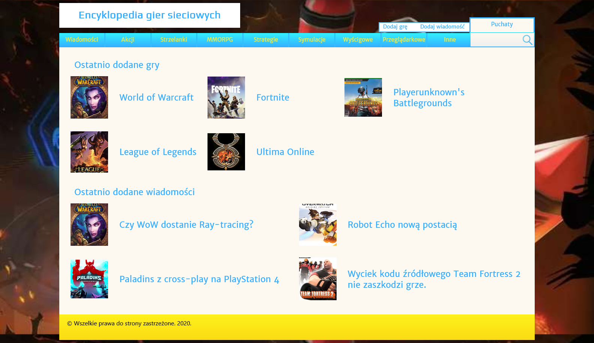
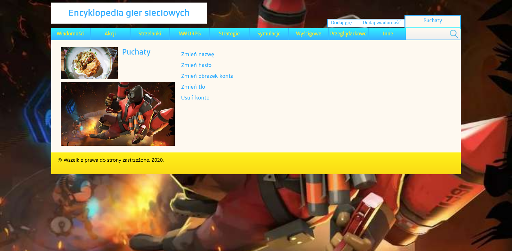

# Encyklopedia-gier-online
## PL
**Technologie**
JavaScript + jQuery, PHP 5.6 i MySQL (MariaDB). 
Strona internetowa dotycząca gier online. Zawiera m.in. CRUD gier i aktualności, tworzenie konta. 
W grach oprócz informacji tekstowych, takich jak tytuł czy opis, można dodać multimedia, czyli galerię obrazów oraz filmy. 
Formularz wiadomości jest prosty i zawiera pola tytułu, opisu, grafiki otwierającej oraz jakiej gry dotyczy.
Istnieją dwa typy kont: użytkownik zwykły oraz administrator. 
* Niezarejestrowany użytkownik może przeglądać gry i aktualności. 
* Zwykły uzyskuje możliwość personalizacji witryny tzn. swojego awatara oraz tła strony. 
* Administrator oprócz tego może dodawać, edytować oraz usuwać gry i aktualności. 

**Uruchomienie**
1. Pobieramy, instalujemy i uruchamiamy pakiet XAMPP
2. W XAMPP uruchamiamy serwery Apache oraz MySQL
3. Importujemy bazę z pliku onlineGamesEncyclopaedia.sql 
3.1. Klikamy przycisk Admin w wierszu MySQL. Otworzy się phpMyAdmin 
3.2. W nim z górnej belki naciskamy import 
3.3. W oknie importu wskazujemy plik i naciskamy import
4. Umieszczamy pliki projektu do folderu htdocs (znajduje się w lokalizacji instalacji XAMPP-a)
5. Witryna dostępna jest pod https://localhost/<nazwa-folderu>/sites/index.php  
(po pobraniu z GitHuba domyślna nazwa-folderu to Encyklopedia-gier-online-main)  

Czerwiec 2020

**Obrazki pod angielskim opisem**

## EN
**Technologies**
JavaScript + jQuery, PHP 5.6 and MySQL (MariaDB). 
Website about online games. Contains including CRUD for games and news, account creating. 
Games except text information, such as title or description, you can add multimedia that is images gallery and videos. 
Exists two types of accounts: regular user and admin. 
* Non-registered user can preview games and news. 
* Regular user can personalize website that is means avatar and background. 
* Admin except this can add, edit and delete games and news. 

**Launching**
1. Download, install and run XAMPP package
2. In XAMPP run Apache and MySQL servers
3. Import database from file onlineGamesEncyclopaedia.sql 
   3.1. Click Admin button in MySQL row. Should open phpMyAdmin 
   3.2. In phpMyAdmin on the top bar click import 
   3.3. In import window choose file and click import
4. Place project files to htdocs folder (is located in XAMPP install localization)
5. Website is available in link https://localhost/<folder-name>/sites/index.php  
   (after downloading from GitHub default folder-name is Encyklopedia-gier-online-main) 

June 2020

Strona główna/Home

Strona profilu/Profile site

Strona gry/Game site

Edycja gry/Game edit

Galeria/Gallery

Filmy/Videos
